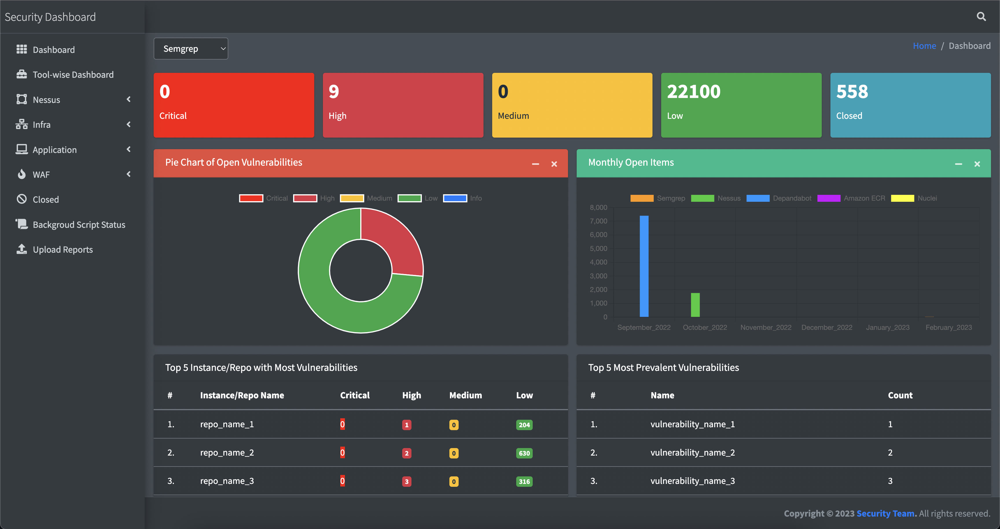

<h1 align="center">
   
    :eyeglasses: Thirdeye
   
   
</h1>

# Summary

Thirdeye tool is a security dashboard that integrates findings from multiple security tools to provide a unified view of all findings & tracking the findings.

## Tech Stack

- **Client:** AdminLTE Theme and Javascript

- **Server:** Django

## Features
Tools integrated:-
- Semgrep
- Gitleaks
- Amazon ECR (Scan)
- Nessus
- Nuclei
- Depandabot
- Cloud Custodian

Other Features:-
- AWS WAF (Summary)
- Permission of s3 Buckets
- Permission of Firebase URL 
- Route53 public domains
- Block IP on WAF with time duration
- Rate-limit on endpoints based on custom HTTP header (like auth token)

## Documentation
- Main Dashboard for complete View

</a>

- Tool-Wise Dashboard which shows the Top 5 findings & Top 5 instance/repo.

</a>

- Gileaks Tool Result with feature to mark finding as False Positive and provide JIRA details. 

</a>

- AWS Service s3 permissions page.

</a>

- Cloud Custodian Policy findings page.

</a>

- AWS WAF blocks IP addresses with a time duration feature.

</a>
## Roadmap

- Open Source the Code

- JIRA integration for status

## Authors

- [@phreak1990](https://github.com/phreak1990)

# Hi, I'm Apoorv Kishore! 👋

## 🔗 Links

## 🚀 About Me
I'm from India. Love to create automation scripts in python.

## Feedback

If you have any feedback, please reach out to me at kishoreapoorv0@gmail.com

